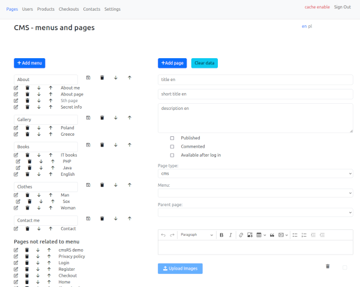
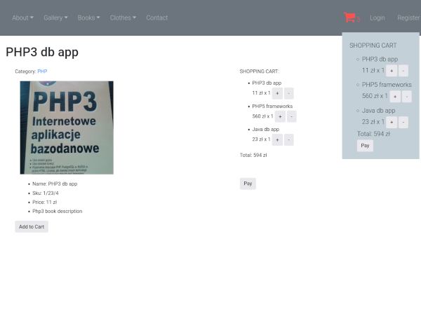
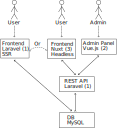

<p align="center">
    <br/>
    Modern CMS for websites and galleries, and even stores, without the chaos.
</p>
</br>
<p align="center">
<a href="https://www.php.net/"></a>
<a href="https://github.com/laravel/laravel"></a>
<a href="https://www.cmsrs.pl/en/cms/cmsrs/coverage-test"></a>
<a href="#"></a>
<a href="https://github.com/cmsrs/cmsrs3/blob/master/LICENSE"></a>
</p>
</br>
</br>

<p>CmsRS is a next-generation <a href="https://en.wikipedia.org/wiki/Content_management_system" target="_blank">CMS</a>, designed as an alternative to bloated solutions that become difficult to develop and maintain over time. Instead of dozens of plugins and complex dependencies, you get a clean architecture based on proven technologies.</p>

<p>Its architecture is built on a clear separation of concerns: <strong>Laravel</strong> serves as the server-side <strong>API</strong>, while <strong>Vue.js</strong> powers the administrative panel. The frontend layer remains flexible — it can be implemented using Blade or in a <strong>headless</strong> mode (e.g., with <strong>Nuxt</strong>).</p>

<p>This separation helps maintain order within the system and makes it easier to develop, test, and adapt to future needs.</p>

<p>
This also applies to the database structure, which is simple and straightforward, eliminating another layer of complexity (see: <a target="_blank" href='/en/cms/cmsrs/db-schema'>Database Schema</a>). <strong>Thanks to solid unit and integration test coverage, as well as the use of PHPStan, even upgrading to newer versions of PHP or Laravel becomes a more predictable and less painful process.</strong>
</p>

<p>CmsRS offers native support for multiple languages (e.g., English and Polish) and includes a dedicated online shop module. It is released as open-source software under the MIT License.</p>

</br>
<p>
    <a href="https://www.cmsrs.pl/en/cms/cmsrs/cmsrs-installation">🚀 Install</a> | 
    <a target="_blank" href="https://www.cmsrs.pl/en/cms/cmsrs/demo-version">🌐 Demo</a>
</p>

</br>

<div>
    
    
</div>

</br>

## 🤔 Why cmsRS?

Unlike traditional CMS platforms:
- Clear separation of concerns: Laravel backend/API, Vue.js administration panel, and flexible frontend layer
- Laravel-based API backend with Vue.js administration panel
- Flexible frontend approach: Blade-based rendering or headless frontend via REST API
- Predictable updates supported by automated testing
- Developer-friendly architecture based on modern standards
- Clean and logical database structure


## ✨ Features

- ⚡ Modern Laravel API + Vue.js/Nuxt architecture
- 🌍 Multi-language support
- 📝 Content management system for pages and custom content
- 🧭 Flexible menu and navigation management
- 🖼️ Gallery system
- 🛒 Product catalog management
- 🔐 User authentication and access management
- 🧪 90% test coverage
- 🧠 Clean and predictable architecture


## cmsRS architecture: Laravel (backend/API) + Vue.js (administration panel) + flexible frontend layer (Blade or Nuxt)



<ul>
<li>(1) <a href="https://github.com/cmsrs/cmsrs3" target="_blank">GitHub – cmsrs3 (Laravel) - Serwer</a></li>
<li>(2) <a href="https://github.com/cmsrs/cmsrs3-vuejs" target="_blank">GitHub – cmsrs3-vuejs - Admin Panel</a></li>
<li>(3) <a href="https://github.com/cmsrs/cmsrs3-nuxt" target="_blank">GitHub – cmsrs3-nuxt - Frontend Nuxt</a></li>
</ul>


## REQUIRED PACKAGES

```php-cli``` – PHP command-line interface

```php-dom``` and ```php-xml``` – for XML parsing (used in layouts and configs)

```php-curl``` – for HTTP requests

```php-mysql``` – for MySQL database connection

```php-mbstring``` – for multibyte string support (required by PHPUnit and some packages)

```php-gd``` – for image processing (used in gallery, sliders, etc.)

Make sure all extensions match your installed PHP version (e.g., php8.5-mysql, php8.5-mbstring, etc.)

## INSTALLATION

Before running the script, make sure you have configured the database connection (host, database name, username, password, and port).

Run the following command to create the project:

```bash
composer create-project cmsrs/cmsrs3
cd cmsrs3 
php artisan cmsrs:install
php artisan serve
```

Once the server is running, open your browser and navigate to:

```bash
http://127.0.0.1:8000
```


## RUN TESTS (RECOMMENDED)

* Prepare .env.testing file, and change db connection (DB_DATABASE should be different than the one in the .env file):


```bash
cp .env .env.testing 
```

* run tests: 

```bash
./vendor/bin/phpunit
```

## MANAGEMENT

* Go to the website http://127.0.0.1:8000/admin/

    log in as:

    username: adm@cmsrs.pl

    default password: cmsrs123

* Create main page (page type: **main_page**)

* Add menu
    
* Add pages   


## CLI COMMANDS 

* Create sitemap (it is recommended to put this command in the crontab file): 

```bash
php artisan cmsrs:create-site-map
```

* Create client user or edit password for user: 

```bash
php artisan cmsrs:create-client {user} {password}
```

* Change admin password:

```bash
php artisan cmsrs:change-admin-pass {new-password}
```

## DEMO - Frontend

http://demo.cmsrs.pl

## DEMO - Admin Panel

http://demo.cmsrs.pl/admin-demo

## MORE INFORMATION

https://www.cmsrs.pl/en/cms/cmsrs/about-cmsrs

## REPORTING ISSUES AND SUGGESTIONS

If you notice any problems or have ideas to improve the project, please use the [Issues](https://github.com/cmsrs/cmsrs3/issues) section to let me know.
If you like it, give it a star!
Your support motivates me to keep improving the project. Thank you! :)

## CONTRIBUTING

Contributions are welcome!  
Feel free to open issues or submit pull requests.

## LICENSE

This project is licensed under the MIT License.